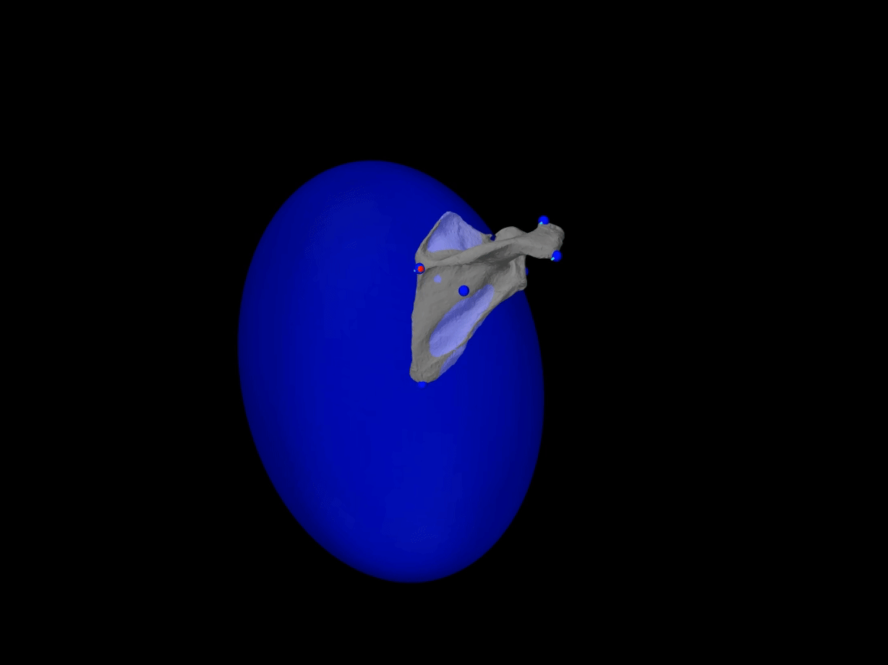
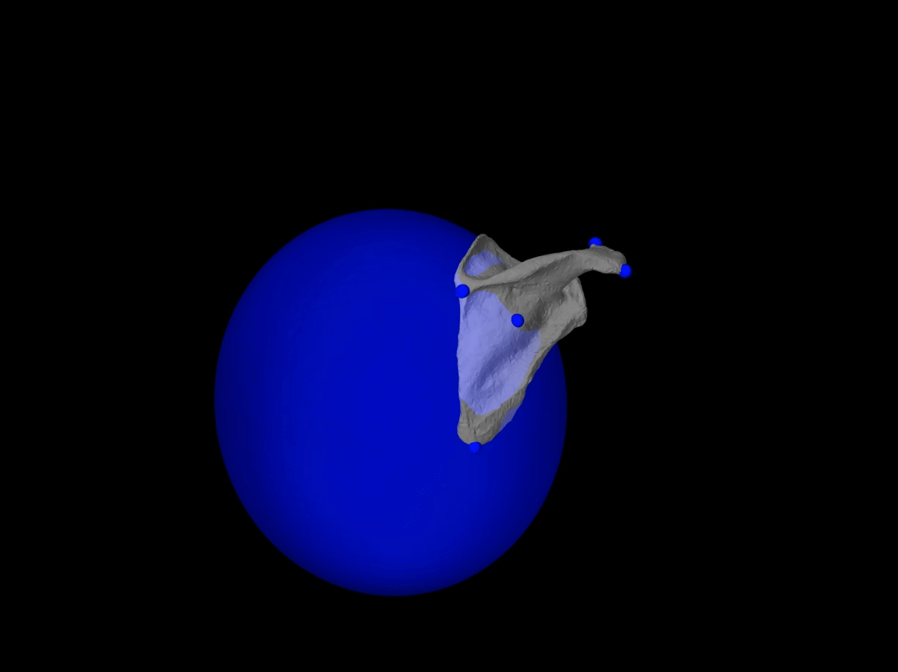

# Videos of Shoulder Ellipsoid Joints
Blue traces are target markers from biplane, orange traces are markers from model with ellipsoid joint.

## Static Ellipsoid with Frame 3 (based on initial pose)

## Dynamic Ellipsoid with Frame 3 (based on initial pose)

